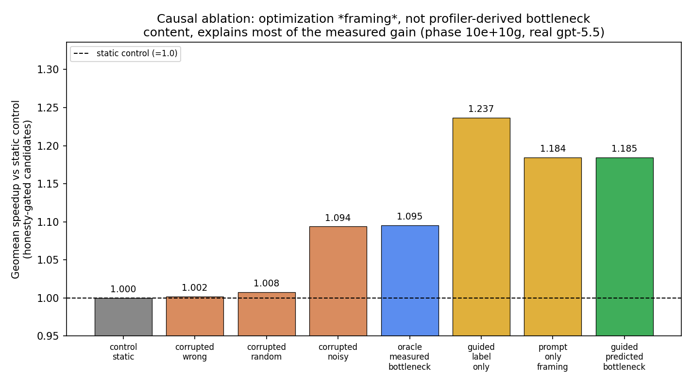
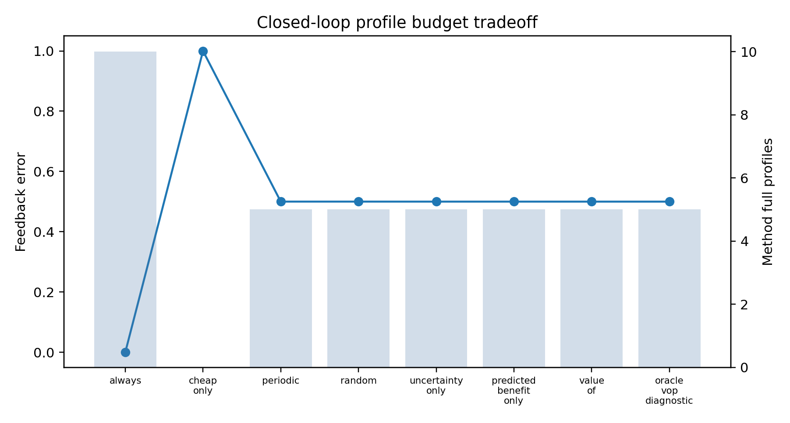
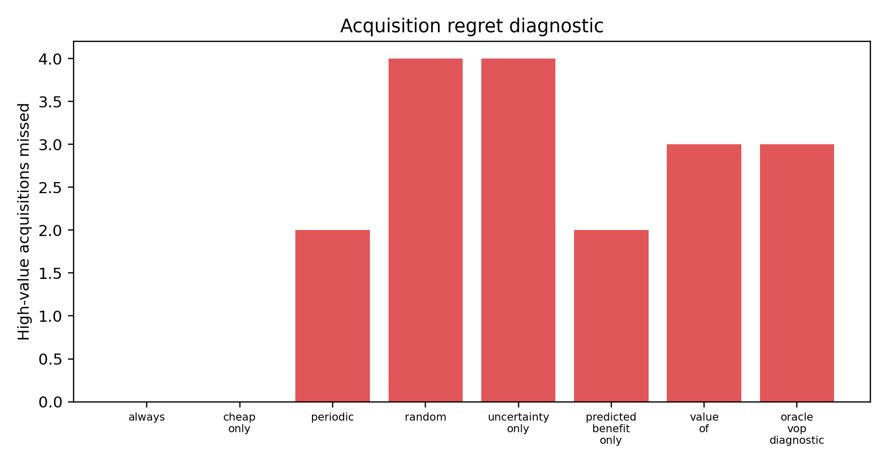
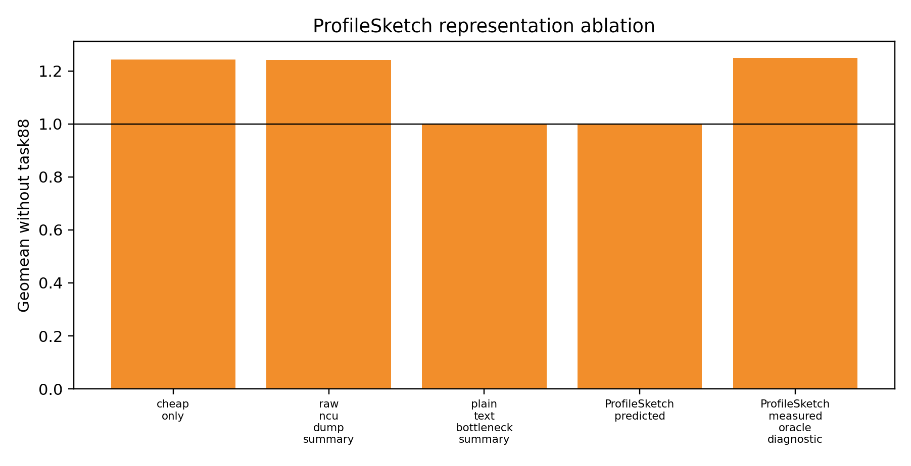

# ProfBridge: LLM-Guided GPU Kernel Optimization


-green)


> A research prototype for evaluating LLM-generated GPU kernel optimization candidates with profiler feedback from NVIDIA Nsight Compute — built around an honest, controlled causal-ablation methodology.

## TL;DR

ProfBridge is an end-to-end research harness for studying whether profiler feedback can be **represented, predicted, selectively acquired, and causally attributed** inside an LLM-guided GPU kernel search loop. The headline scientific contribution is **not** a "we made kernels faster" claim — it is a controlled causal ablation that **quantifies why** an intuitive hypothesis fails:

> Feeding profiler-derived bottleneck signals into the LLM prompt does **not** beat a generic "optimize this" prompt. Generic optimization *framing* — not the profiler-derived numeric content — explains essentially all of the measured speedup.

This is a deliberately honest, falsification-style result backed by real GPU measurements, an automated honesty gate, and paired bootstrap statistics.

## Headline Result: Causal Ablation of Profiler-Guided Search

We re-analyzed two pre-existing controlled ablation phases (real `gpt-5.5` generations, 85 candidates, KernelBench-style Level-1 tasks) after applying an automated honesty gate (correctness + robust-correctness + loophole scan + safety scan + Nsight success). Every arm shares the same task set and parent candidate; the only thing that changes is **what bottleneck information the prompt receives**.



| Contrast (paired by task, honesty-gated) | Geomean ratio | 95% CI | One-sided p (A not better) |
|---|---:|---:|---:|
| predicted-bottleneck vs static control | 1.185 | [0.99, 1.66] | 0.118 |
| **prompt-only framing** vs static control | 1.184 | [1.00, 1.65] | 0.063 |
| predicted-bottleneck vs **prompt-only framing** | 1.000 | [0.99, 1.01] | 0.480 |
| oracle measured-bottleneck vs static control | 1.095 | [1.00, 1.29] | 0.000 |

**How to read this:**

- Predicted-bottleneck guidance is the top "real-signal" arm (+18% geomean over static control), which *looks* like a win.
- But **prompt-only framing matches it almost exactly** (ratio 1.000, p = 0.48): the structured profiler-derived numeric content adds nothing over simply telling the model "this is an optimization task."
- A clean causal story would require `oracle > predicted > corrupted`. Instead, **corrupted-noisy ≈ oracle**, and framing dominates — so the gain is **not** caused by bottleneck-signal correctness.
- With only 5 paired tasks the predicted-vs-static contrast is **not** statistically significant.

Raw numbers: [`tables/curated/search_quality_by_arm.csv`](tables/curated/search_quality_by_arm.csv); full interpretation: [`reports/curated/causal_ablation_framing_finding.md`](reports/curated/causal_ablation_framing_finding.md).

## Why This Result Is the Point

A portfolio-grade research artifact is judged by methodology and honesty, not by a green bar. This experiment demonstrates:

- a **controlled causal design** with static, predicted, label-only, oracle, wrong, random, and noisy bottleneck arms sharing one task set;
- an **automated honesty gate** that strips loophole/unsafe/incorrect candidates *before* any claim is computed;
- **paired bootstrap inference** with confidence intervals instead of single-point bragging;
- a **falsified hypothesis, reported as falsified** — generic framing, not profiler content, drives the gain.

## Abstract

LLM-guided compiler optimization systems can generate many candidate GPU implementations, but evaluating every candidate with a high-fidelity profiler is expensive. This project explores whether profiler feedback can be represented, predicted, and selectively acquired under a limited profiling budget — and, critically, whether profiler-derived guidance is *causally* responsible for any search-quality improvement.

**ProfBridge** builds an end-to-end research prototype around KernelBench-style GPU operators, PyTorch, NVIDIA Nsight Compute, and LLM-generated candidate code. It introduces a structured feedback representation called `ProfileSketch` and evaluates `Value-of-Profile`, a policy that decides whether a candidate should receive full profiler feedback or use predicted feedback instead.

This repository is not a finished paper and does not claim that ProfBridge is a production GPU kernel generator. The conclusions are deliberately conservative: reducing profiling calls alone is not a strong compiler-paper contribution, and profiler-derived prompt content does not (in this prototype) causally outperform generic optimization framing. The most useful outcome is an experimental infrastructure for GPU profiling, candidate evaluation, feedback representation, and rigorous claim calibration.

## Technical Contributions

For fast scanning — what was actually engineered here:

- **NVIDIA Nsight Compute integration** (`profbridge/profile/ncu.py`): subprocess wrapper, selected-metric parser, and failure/partial-success accounting around `ncu`.
- **`ProfileSketch` structured representation** (`profbridge/profile_sketch/`): compact schema bundling predicted profiler metrics, uncertainty, bottleneck labels, signal provenance, and acquisition-decision metadata.
- **`Value-of-Profile` acquisition policy** (`profbridge/profile_sketch/value_of_profile.py`): offline-replayable evaluator comparing always/cheap/periodic/random/uncertainty/VoP/oracle policies on cost, feedback error, and search quality.
- **Closed-loop Autocomp-style search** with PyTorch eager/candidate timing and correctness harnesses (`profbridge/eval/`).
- **Automated honesty gate**: robust-correctness, loophole scanner, and safety scanner that filter candidates before any speedup is claimed.
- **Causal-ablation analysis** (`scripts/analyze_bottleneck_guided_search_quality.py`): paired bootstrap contrasts across bottleneck-signal arms with confidence intervals.

## Motivation

Recent LLM-guided compiler systems ask:

> Which optimization candidate should we generate next?

This project studied a related systems question:

> If an LLM generates many candidates, do we need to fully profile every candidate — and does profiler-derived guidance actually cause better candidates?

Full GPU profiling with NVIDIA Nsight Compute provides hardware-level signals such as memory traffic, instruction count, and warp activity, but it is much more expensive than simple latency measurement or static feature extraction. ProfBridge treats this profiler feedback as a scarce resource *and* as a hypothesis to be falsified, not assumed.

## Background

This project sits near three research areas:

- **Tensor compiler autotuning** such as TVM, AutoTVM, Ansor, and MetaSchedule.
- **LLM-guided compiler search** such as Reasoning Compiler and Autocomp.
- **Profiler-guided GPU kernel optimization** systems that use measured hardware feedback.

ProfBridge does not aim to be a better code generator than these systems. Instead, it focuses on a narrower question: how expensive profiler feedback can be represented, acquired, analyzed, and *causally attributed* inside such search loops.

## Key Idea

ProfBridge uses a compact structured representation called `ProfileSketch`.

A `ProfileSketch` contains:

- predicted profiler metrics,
- uncertainty estimates,
- bottleneck labels,
- signal provenance,
- acquisition decision metadata.

A `Value-of-Profile` policy then decides whether full profiling is worth paying for.

```text
candidate code
    -> cheap timing / static features
    -> ProfileSketch
    -> Value-of-Profile decision
    -> full profile or predicted feedback
    -> next optimization step
```

## What I Built

This repository contains:

- KernelBench-style GPU candidate evaluation utilities,
- PyTorch eager and candidate timing/profiling harnesses,
- NVIDIA Nsight Compute wrapper and selected metric parser,
- profile-pair schema and validation utilities,
- ProfileSketch representation,
- Value-of-Profile policy evaluator,
- closed-loop policy analysis scripts,
- causal-ablation analysis with paired bootstrap statistics,
- statistical sanity checks,
- robust correctness and candidate-loophole scanner,
- curated reports, tables, and figures.

## Profiling-Policy Experiments

Beyond the causal ablation above, the prototype compares several profiling policies:

| Policy | Description |
|---|---|
| always-profile | Full profiling for every candidate |
| cheap-only | No full profiling |
| periodic-profile | Profile at fixed intervals |
| random-profile | Profile randomly under budget |
| uncertainty-only | Profile high-uncertainty candidates |
| Value-of-Profile | Profile candidates with high estimated profiling value |

Metrics include full profiler calls, method wall-clock, feedback error, search-quality/speedup, correctness pass rate, and Nsight Compute success rate.



The strongest profiling-policy result is **not** that Value-of-Profile significantly improves feedback error — the feedback-error margins are very small. The safer interpretation is:

> ProfBridge can reduce full profiling cost while maintaining comparable feedback quality in a bounded prototype.

Example closed-loop result:

| Metric | always-profile | Value-of-Profile |
|---|---:|---:|
| full profiles | 10 | 5 |
| method wall-clock | 456.17s | 357.81s |
| feedback error | 0.0 | 0.499866 |
| valid candidates | - | 105/105 |

The `feedback error 0.0 → 0.499866` change is **a budgeted prediction trade-off, not a regression**: always-profile measures every candidate (zero prediction error by construction), while Value-of-Profile predicts the un-profiled half and accepts bounded shadow error in exchange for halving profiler calls. Budgeted baselines had very similar feedback-error values, so this project does **not** claim statistically significant feedback-error superiority.




## Critical Analysis & Honest Evaluation

Several hypotheses became weaker — or were outright falsified — after experiments. These are reported as findings, not buried:

1. **Profiler-derived prompt content is not causally better than generic framing.** Quantified above: predicted-bottleneck vs prompt-only framing ratio = 1.000 (p = 0.48). This is the central honest result.
2. **Profiling reduction alone is not a strong compiler-paper contribution.** Many autotuning systems already reduce measurement cost.
3. **Value-of-Profile did not clearly dominate uncertainty-only.** Uncertainty-only was a strong baseline.
4. **`ProfileSketch` was not uniformly better as a prompt representation.** Its defensible role is as a structured representation for acquisition, accounting, and provenance — not as a magic prompt.
5. **Speedup causality was mixed.** Oracle did not dominate predicted or corrupted arms, so a clean dose-response causal story does not hold.
6. **The research direction needed reframing.** A stronger future direction is to design prompts that separate "mentions optimization" from "contains profiler-derived numeric signal," with enough tasks for statistical power.

## Lessons Learned

This project produced both working infrastructure and a rigorously characterized negative result.

Main lessons:

- A compiler paper needs a performance-seeking story with a *causal* attribution, not only overhead reduction or correlational speedups.
- LLM-generated candidate search must be evaluated against strong baselines, including a generic-framing control.
- Effect-size and significance must be established before any superiority is claimed.
- Honesty gates (loophole/safety/robust-correctness) must run *before* metrics, or speedups are not trustworthy.
- Honest claim calibration is more valuable than optimistic labeling.

## Repository Structure

```text
profbridge/
├── profbridge/       # core Python package
├── scripts/          # experiment and analysis scripts
├── configs/          # experiment configs
├── docs/             # method and workflow documentation
├── reports/curated/  # curated experiment reports
├── tables/curated/   # summarized result tables
├── figures/curated/  # curated figures
└── examples/         # small example records
```

## Installation

The public release is lightweight — curated analysis runs without a GPU:

```bash
python -m venv .venv && source .venv/bin/activate   # optional
pip install -r requirements.txt                     # numpy, PyYAML, scikit-learn
```

Live GPU evaluation additionally requires CUDA-enabled PyTorch, NVIDIA Nsight Compute (`ncu`), KernelBench-style task files, and (optionally) an LLM API key for generating new candidates. These are **not** needed to reproduce the curated tables, figures, and the headline causal-ablation analysis.

## How to Run

### 1. Environment check

```bash
python -m compileall profbridge scripts
python scripts/smoke_test.py
```

### 2. Reproduce the headline causal-ablation result

```bash
python scripts/analyze_bottleneck_guided_search_quality.py
```

### 3. Build ProfileSketch records from examples

```bash
python scripts/build_profile_sketches.py --input examples/minimal_profile_pair.jsonl --out results/profile_sketches.jsonl
```

### 4. Run Value-of-Profile replay

```bash
python scripts/run_value_of_profile_eval.py --profile-sketches examples/sample_profilesketches.jsonl --profile-budget-fraction 0.5 --policy always_profile,cheap_only,periodic_profile,uncertainty_only,value_of_profile
```

### 5. Run statistical sanity analysis

```bash
python scripts/analyze_p10h_statistical_sanity.py
```

## Reproducibility Notes

This project depends on:

- CUDA-enabled PyTorch for live GPU evaluation,
- NVIDIA Nsight Compute for full profiling,
- KernelBench or KernelBench-style task files,
- optional LLM API access for generating new candidates.

Most curated analysis — including the headline causal ablation — can be inspected without new LLM calls or a GPU using the included reports, tables, and example records.

## Limitations

This is a research prototype, not a final paper.

Known limitations:

- small task count (5 paired tasks in the causal ablation) limits statistical power,
- one task had strong influence on aggregate speedup results,
- one task remained unresolved due to constructor/signature mismatch,
- feedback-error margins were tiny,
- uncertainty-only was a very strong baseline,
- `ProfileSketch` representation ablation was mixed,
- no claim of beating Autocomp, Reasoning Compiler, or production GPU kernel generators.

## Current Status

The original paper framing — "reduce profiler calls with `ProfileSketch` and `Value-of-Profile`" — is not strong enough by itself for a top compiler paper, and the controlled ablation shows profiler-derived prompt content does not causally beat generic optimization framing in this prototype.

The useful outcome is a reusable research infrastructure plus a clearly characterized, honestly reported negative result and a concrete future direction:

> Design experiments that isolate "the prompt mentions optimization" from "the prompt carries profiler-derived numeric signal," with enough tasks for statistical power, before claiming profiler-guided search beats generic search.

This repository is kept as a research prototype and portfolio artifact demonstrating ML-systems / compiler experimentation, GPU profiling, LLM-guided candidate evaluation, controlled causal ablation, and honest claim calibration.

## License

MIT — see [LICENSE](LICENSE).
